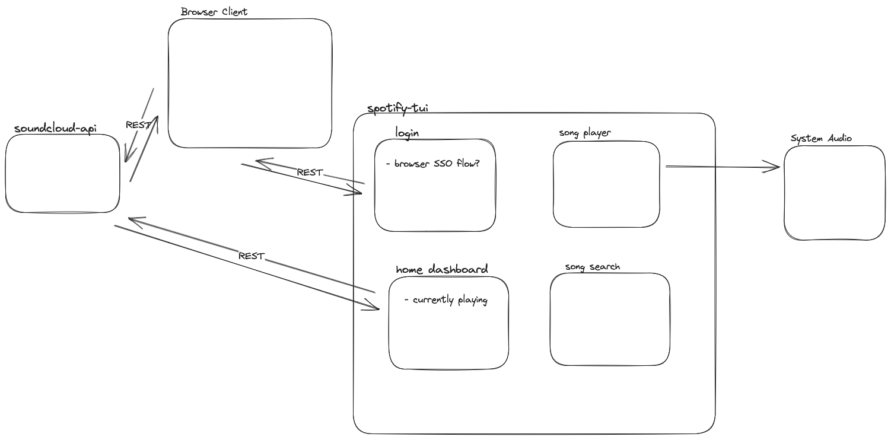

# Soundcloud TUI

Terminal UI (_tui_) client that allows you to interact with your soundcloud playlists directly from within your terminal.

## Solution Diagram

[dependencies]
crossterm = "0.27"
tui = { version = "0.19", default-features = false, features = ['crossterm'] }
tokio = { version = "1.14.0", features = ["full"] }
anyhow = "1.0.42"
futures-core = "0.3.28"
futures = "0.3.28"
reqwest = "0.12.4"
mockito = "1.2.0"
serde_json = "1.0.111"
rodio = "0.17.3"
m3u8-rs = "6.0.0"
bytes = "1.6.0"

[dev-dependencies]
async-trait = "0.1.72"
tokio-test = "0.4.2"
unimock = "0.6.5"
